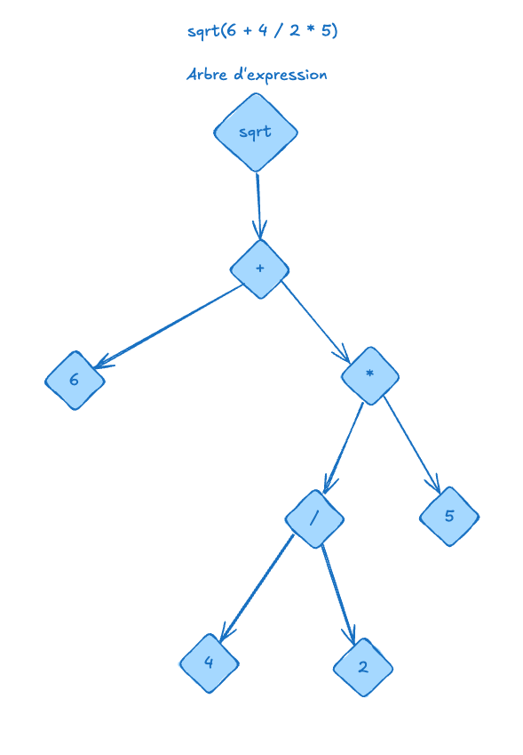

# expression-tree

## Concept

This is a simple expression tree implementation in TypeScript. It allows you to parse mathematical expressions and evaluate them using a tree structure.



## Development

To install dependencies:

```bash
bun install
```

To run:

```bash
bun run index.ts
```

