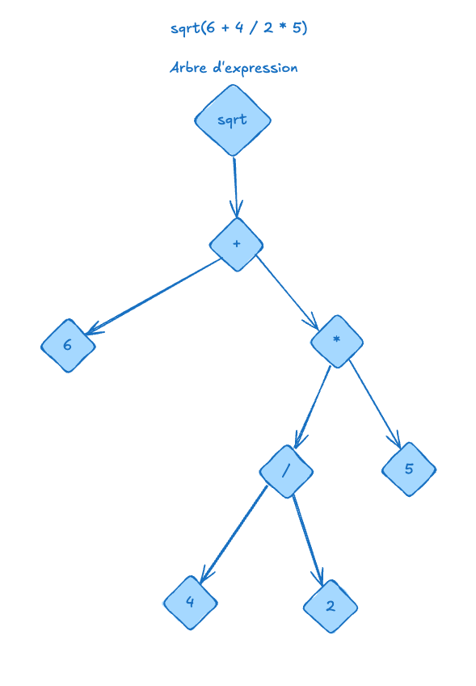

# expression-tree

[](https://sonarqube.florentmarques.fr/dashboard?id=expression-tree)
[](https://sonarqube.florentmarques.fr/dashboard?id=expression-tree)
[](https://sonarqube.florentmarques.fr/dashboard?id=expression-tree)

## Concept

This is a simple expression tree implementation in TypeScript. It allows you to parse mathematical expressions and evaluate them using a tree structure.



## Features

- [x] Parse mathematical expressions into a tree structure.
- [x] Evaluate expressions using the tree.
- [x] Support for basic arithmetic operations
  - [x] addition
  - [x] subtraction
  - [x] multiplication
  - [x] division
  - [x] exponentiation
  - [x] unary minus
  - [x] parentheses
  - [x] operator precedence
  - [x] operator associativity
  - [ ] square root
  - [ ] absolute value
  - [ ] trigonometric functions (sin, cos, tan)
  - [ ] logarithm

## Prerequisites

- [Bun](https://bun.sh/) (version 1.0.0 or higher)

## Example

```shell
$ bun run examples/example.ts
```

Output:

```text
-------------------
expected: 6 - -2 + 5 = 13
actual:   6 - -2 + 5 = 13
same ?    true
-------------------
expected: 6 + -(2 + 5) = -1
actual:   6 + -(2 + 5) = -1
same ?    true
-------------------
expected: 6 + -2 * 5 = -4
actual:   6 + -2 * 5 = -4
same ?    true
-------------------
expected: 6 + 4 / 2 * 5 = 16
actual:   6 + 4 / 2 * 5 = 16
same ?    true
-------------------
expected: 6 + -(2 * 5) = -4
actual:   6 + -(2 * 5) = -4
same ?    true
-------------------
expected: 6 + 2 * 3 - 1 = 11
actual:   6 + 2 * 3 - 1 = 11
same ?    true
-------------------
expected: 6 + 2 * 3 - 1 + 2 ^ 2 = 15
actual:   6 + 2 * 3 - 1 + 2 ^ 2 = 15
same ?    true
```

## Development

To install dependencies:

```bash
bun install
```
